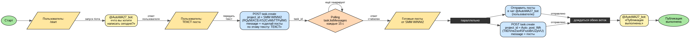

# POSTWA — Telegram-бот [@AutoWA27_bot](https://t.me/AutoWA27_bot)

## Блок-схема



Исходник: [`docs/flow.dot`](docs/flow.dot) (Graphviz). Пересобрать PNG:
`dot -Tpng docs/flow.dot -o docs/flow.png`

## Что делает бот

```
/start
  → "что вы хотите написать сегодня?"
  → пользователь присылает текст
  → бот создаёт задачу в Manus / SMM WINNI2 (project RQy56XCErXS2CvWbTTPy8W)
  → ожидает готовых постов (polling task.listMessages)
  → параллельно:
       • отправляет посты пользователю в Telegram
       • создаёт задачу в Manus / Auto_post_WA (project T8DVneZso4SFxzoBrUZpVU)
  → "Публикация выполнена."
```

## Структура файлов

| Файл | Назначение |
|------|-----------|
| `bot.py` | Telegram-хендлеры, FSM, точка входа |
| `manus.py` | Manus API: создание задач, polling |
| `config.py` | Переменные окружения |
| `.env` | Секреты (не коммитить!) |

---

## Запуск на ПК (пошаговая инструкция)

### Шаг 1 — Установить Python

**Windows:**
1. Открыть https://www.python.org/downloads/ → скачать версию 3.11 или 3.12
2. При установке обязательно поставить галочку **"Add Python to PATH"**
3. Проверить в командной строке (`Win+R → cmd`):
   ```
   python --version
   ```

**Mac/Linux:**
```bash
python3 --version   # должно быть 3.10+
```

---

### Шаг 2 — Скачать код

**Вариант A — через Git:**
```bash
git clone https://github.com/Maxfloy27-Msk/POSTWA.git
cd POSTWA
git checkout claude/elegant-dirac-WgUmy
```

**Вариант B — скачать ZIP:**
На странице репозитория GitHub → Code → Download ZIP → распаковать.

---

### Шаг 3 — Создать файл `.env`

В папке проекта создать файл `.env` (скопировать `.env.example` и заполнить):

```
BOT_TOKEN=8804865639:AAHfnuX2B4h2TmSFs4290BiVJg8ACO3K0_A
MANUS_API_KEY=ваш_ключ_manus
POLL_INTERVAL=15
TASK_TIMEOUT=600
```

> ⚠️ Файл `.env` внесён в `.gitignore` — в GitHub он никогда не попадёт.

---

### Шаг 4 — Установить зависимости

**Windows (cmd или PowerShell):**
```cmd
cd C:\путь\к\папке\POSTWA
python -m pip install -r requirements.txt
```

**Mac/Linux:**
```bash
cd ~/POSTWA
pip3 install -r requirements.txt
```

---

### Шаг 5 — Запустить бота

**Windows:**
```cmd
python bot.py
```

**Mac/Linux:**
```bash
python3 bot.py
```

Вы увидите в консоли:
```
2026-06-06 12:00:00 [INFO] __main__: Bot @AutoWA27_bot starting
```

Бот работает, пока открыт терминал. Чтобы остановить — `Ctrl+C`.

---

### Шаг 6 — Проверить

Откройте Telegram → найдите **@AutoWA27_bot** → `/start`.

---

## Manus API — используемые эндпоинты

| Эндпоинт | Метод | Назначение |
|----------|-------|-----------|
| `task.create` | POST | Создать задачу в проекте |
| `task.listMessages` | POST | Получить сообщения задачи (polling) |

### Формат `task.create`
```json
POST https://api.manus.ai/v2/task.create
Authorization: Bearer <MANUS_API_KEY>

{
  "project_id": "RQy56XCErXS2CvWbTTPy8W",
  "message": "сделай посты по этому тексту: ..."
}
```

Ожидаемый ответ:
```json
{ "id": "task_xxx", ... }
```

### Формат `task.listMessages`
```json
POST https://api.manus.ai/v2/task.listMessages

{ "task_id": "task_xxx" }
```

Ожидаемый ответ:
```json
{
  "messages": [
    { "role": "user",      "content": "..." },
    { "role": "assistant", "content": "..." }
  ]
}
```

Задача считается завершённой, когда количество сообщений не меняется 2 цикла подряд (2 × 15 с = 30 с) и есть хотя бы одно сообщение от assistant.
